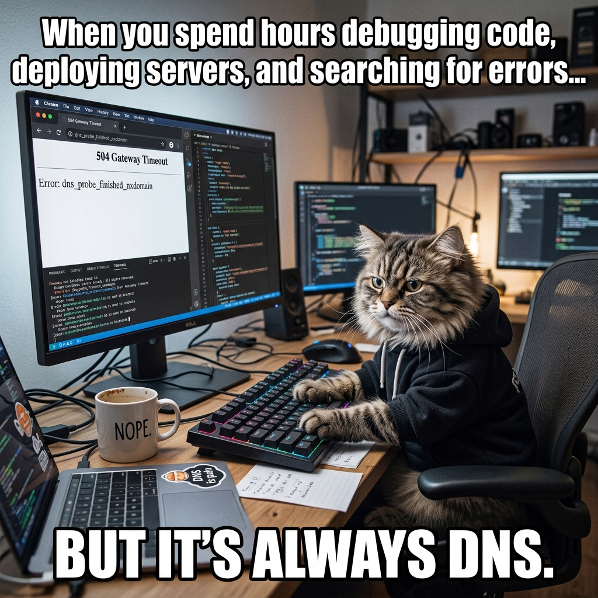

<div align="center">
  
  
  # 🌐 CN (Computer Networks) 
  ### *Where Data Meets Destiny: A Developer's Journey Through the Digital Backbone*
  
  <p align="center">
    
    
    
    
  </p>
</div>

```text
╔═══════════════════════════════════════════════════════════════════════════════╗
║                                                                               ║
║  "The Internet is 99% visible light traveling through fiber optic cables      ║
║   at the speed of light, and 100% magic happening in between."                ║
║                                                                               ║
║  Welcome to CN—where we make the magic visible. 🚀                            ║
║                                                                               ║
╚═══════════════════════════════════════════════════════════════════════════════╝
```

<div align="center">
  
  <br/>
  <i>(If it's broken, it's probably DNS... or BGP... or a stray cosmic ray)</i>
</div>

---

## 🎯 **Who Am I?**

I'm **Devashish Mishra**, a Computer Science student at **BITS Pilani** (in partnership with **Scaler School of Technology**), and a fiercely passionate developer who believes that true mastery comes from diving deep into the foundations. Code is poetry, but networking is the stage where that poetry is performed!

This repository is my playground—a collection of meticulously crafted notes on **Computer Networks (CN)**, forged in the fires of:

- 🏛️ **BITS Pilani** — The alma mater conferring my Computer Science degree.
- 🎓 **Scaler School of Technology** — The master architects providing the industry-grade curriculum.
- 🤖 **ChatGPT** — My AI sidekick, turning complex concepts into "aha!" moments.
- 💭 **My Relentless Curiosity** — Because understanding "why" the packets flow matters infinitely more than just memorizing "what" they are.

This isn't just another networking course repository. This is my **intellectual expedition** into the infrastructure that powers our digital world.

---

## 🚀 **What Makes This Different?**

### ✨ Not Just Notes—A Learning Experience

Most repositories collect notes. This one **crafts knowledge architectures**.

✅ **Clear Mental Models** — Every concept builds a foundation, not just sits alone  
✅ **Developer-First Approach** — Learn how *you* interact with these systems daily  
✅ **Memory Aids & Mnemonics** — Because your brain is amazing at patterns  
✅ **Visual & Mathematical** — ASCII diagrams + LaTeX formulas for every scenario  
✅ **Real-World Context** — No "academic-only" concepts here  

---

## 🌟 **Key Features**

### 📐 **Mathematical Precision**
Every formula is rendered in LaTeX. When we say "delay," you'll see proper equations with subscripts and symbols.

### 🎨 **Visual Clarity**
ASCII diagrams for network topology, data flow, and layered architecture. Because some things are better *shown* than explained.

### 🧩 **Conceptual Scaffolding**
Each note builds on the previous one. Skip around at your own risk—these are designed to stack.

### 💬 **Developer Voice**
Technical yet accessible. Academic yet practical. Rigorous yet engaging.

---

## 🔥 **Meme-orial Section**

Because learning should be fun:

> **Why did the TCP packet go to therapy?**  
> *"Because it had too many connections to work through, and everyone kept dropping it!"* 😅

> **What's a router's favorite food?**  
> *"Packet snacks!"* 🍿

> **Why don't TCP/IP engineers trust anyone?**  
> *"They always verify the checksum first."* ✅

> **The OSI Model walks into a bar...**  
> *"...and asks for a drink. The bartender says, 'What layer would you like that on?'"* 🍸

> **Why did the bandwidth apply for a bigger house?**  
> *"It had too much throughput to handle at home!"* 🏠

---

## 🛠️ **How to Use This Repository**

### 👨‍💻 **For Students**
1. **Start with Module 1, Chapter 1** — Context is king
2. **Read sequentially** — Each chapter assumes knowledge from the last
3. **Take your own notes** — These are frameworks, not gospel
4. **Revisit monthly** — Networking concepts have layers (pun intended)

### 🔬 **For Researchers**
- Jump to any section using the table of contents
- Cross-reference formulas and definitions
- Use as a foundation for deeper studies

### 🏢 **For Professionals**
- Refresh your understanding of core concepts
- Use as reference material during design reviews
- Share with junior developers joining your team

---

## 🌍 **The Knowledge Sources**

| Source | Why It Matters | What I Used |
|--------|----------------|------------|
| **Scalar School of Technology** | Industry-standard curriculum | Core concepts & structure |
| **ChatGPT** | Modern AI clarity | Explanations & analogies |
| **My Brain** | Pattern recognition | Synthesis & memory aids |
| **The Internet** | Living documentation | Real-world examples |

---

## 💪 **Why I Built This**

Because I'm a developer who:
- ✅ Believes in understanding systems deeply
- ✅ Gets frustrated with vague explanations
- ✅ Wants to contribute to the learning community
- ✅ Thinks networking is criminally underrated
- ✅ Can't sleep until I understand *why* something works

**This repository is my answer to:** *"What if I spent weeks truly mastering networking and then shared that knowledge?"*

---

## 🤝 **Contributing**

Found a typo? Have a better explanation? Want to add a section?

**I welcome contributions!** Please:
1. Fork the repository
2. Create a branch (`feature/your-improvement`)
3. Submit a pull request with clear descriptions

**Let's build an incredible resource together.**

---

## 📞 **Get In Touch**

Questions about networking or these notes?
- 💌 Reach out with your networking puzzles
- 🧠 Share your "aha!" moments
- 🤔 Point out anything that needs clarity

---

## 📄 **License & Attribution**

✨ **These notes are shared for educational purposes.**

- Credit to **BITS Pilani** & **Scaler School of Technology** for the degree program and curriculum
- Credit to **ChatGPT** for explanations and clarity
- Credit to **Devashish Mishra** for synthesis and curation

Feel free to use, learn, and build upon this knowledge!

---

## 🎯 **The Bottom Line**

```
You came here to learn Computer Networks.
You're leaving as someone who UNDERSTANDS them.

Not just memorized facts.
Not just theory without practice.
Not just confused by OSI layers.

But someone who can:
✅ Explain networking to others
✅ Debug performance issues
✅ Design scalable systems
✅ Appreciate the internet's elegance

THAT'S the goal. Let's make it happen. 🚀
```

---

## 🏁 **Final Thoughts**

> *"Every packet that travels across the globe is a testament to decades of collaborative engineering genius. Behind your simple HTTP request is a symphony of routers, switches, and protocols working in perfect harmony. Understanding how this works isn't academic—it's appreciating the infrastructure that connects humanity."*

**Welcome to your networking journey. Let's go deep. 🌊**

---

**Built with ❤️ by a Developer Who Loves Understanding Systems**

**Last Updated:** August 14, 2026  
**Version:** 1.0 - Foundation Release  
**Status:** 🔥 Ready to Transform Your Networking Knowledge

```
████████████████████████████████████████ 100% PASSION
```

---

### 🌟 **Star this repository if it helped you!**

Your support fuels more deep-dive content like this. Let's grow the community of developers who *truly* understand the networks powering our world.

**Happy Learning, Future Networking Expert!** 🎓🚀
