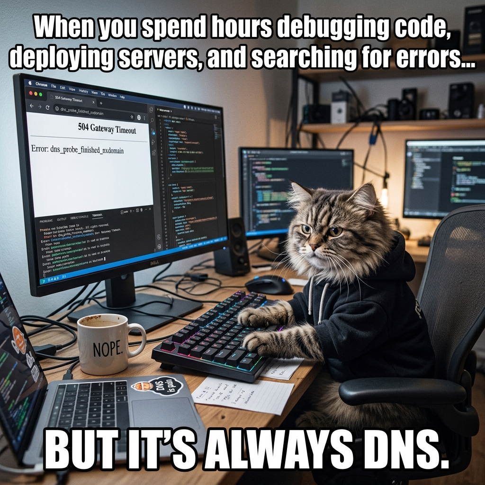

<div align="center">
  
  
  # 🌐 Computer Networks (CN)
  ### *Where Data Meets Destiny: A Developer's Master Journey Through the Digital Backbone*
  
  <p align="center">
    
    
    
    
    
  </p>
</div>

```text
╔═══════════════════════════════════════════════════════════════════════════════╗
║                                                                               ║
║  "The Internet is 99% visible light traveling through fiber optic cables      ║
║   at the speed of light, and 100% magic happening in between."                ║
║                                                                               ║
║  Welcome to CN—where we make the magic visible, interactive, and deep. 🚀      ║
║                                                                               ║
╚═══════════════════════════════════════════════════════════════════════════════╝
```

<div align="center">
  
  <br/>
  <i>(If it's broken, it's probably DNS... or BGP... or an MTU black hole... or a stray cosmic ray)</i>
</div>

---

## 🎯 **Who Am I?**

I'm **Devashish Mishra**, a Computer Science student at **BITS Pilani** (in partnership with **Scaler School of Technology**), and a fiercely passionate developer who believes that true mastery comes from diving deep into the foundations. Code is poetry, but networking is the stage where that poetry is performed!

This repository is my playground—a collection of meticulously crafted, interactive notes on **Computer Networks (CN)**, forged in the fires of:

- 🏛️ **BITS Pilani** — The alma mater conferring my Computer Science degree.
- 🎓 **Scaler School of Technology** — The master architects providing the industry-grade curriculum.
- 🤖 **ChatGPT** — My AI sidekick, turning complex concepts into "aha!" moments.
- 💭 **My Relentless Curiosity** — Because understanding "why" the packets flow matters infinitely more than just memorizing "what" they are.

This isn't just another networking course repository. This is an **intellectual expedition** into the infrastructure that powers our digital world.

---

## 🗺️ **The Master Curriculum Roadmap (All 14 Modules)**

> 💡 **Seamless Sequential Learning:** Start from Module 01, Topic 01, and follow the bidirectional navigation links at the top and bottom of each chapter. The entire repository is linked end-to-end across all 112 topics!

| Module | Module Overview & Hub | Focus & Core Theme | Chapters | Quick Jump |
| :---: | :--- | :--- | :---: | :---: |
| **01** | [**Introduction to Computer Networks**](./Module%2001%3A%20Introduction%20to%20Computer%20Networks/README.md) | Foundations of Connectivity, Physical Infrastructure & Layered Mental Models | **9** | [🚀 Start Chapter 01](./Module%2001%3A%20Introduction%20to%20Computer%20Networks/01_Why_Computer_Networks.md) |
| **02** | [**Network Packets and Layered Communication**](./Module%2002%3A%20Network%20Packets%20and%20Layered%20Communication/README.md) | Protocol Rules, Encapsulation, Framing, MTU & MAC Addressing | **10** | [🚀 Start Chapter 01](./Module%2002%3A%20Network%20Packets%20and%20Layered%20Communication/01_Protocols.md) |
| **03** | [**IP Addresses and Subnetting I**](./Module%2003%3A%20IP%20Addresses%20and%20Subnetting%20I/README.md) | Logical Layer-3 Addressing, Binary Foundations, Network Boundaries & CIDR | **8** | [🚀 Start Chapter 01](./Module%2003%3A%20IP%20Addresses%20and%20Subnetting%20I/01_Why_IP_Addresses.md) |
| **04** | [**IP Addresses and Subnetting II**](./Module%2004%3A%20IP%20Addresses%20and%20Subnetting%20II/README.md) | Practical Subnet Engineering, VLSM, IPv6 Expansion & Gateway Routing | **6** | [🚀 Start Chapter 01](./Module%2004%3A%20IP%20Addresses%20and%20Subnetting%20II/01_Subnetting_Problems.md) |
| **05** | [**Graph Algorithms for Networking**](./Module%2005%3A%20Graph%20Algorithms%20for%20Networking/README.md) | Modeling Networks as Graphs, Breadth-First & Depth-First Search, Dijkstra's Algorithm | **4** | [🚀 Start Chapter 01](./Module%2005%3A%20Graph%20Algorithms%20for%20Networking/01_Graph_Representation.md) |
| **06** | [**Graph Algorithms for Networking II**](./Module%2006%3A%20Graph%20Algorithms%20for%20Networking%20II/README.md) | Distributed Bellman-Ford, Minimum Spanning Trees & Graph Foundations of Routing | **3** | [🚀 Start Chapter 01](./Module%2006%3A%20Graph%20Algorithms%20for%20Networking%20II/01_Bellman_Ford.md) |
| **07** | [**Routing and Forwarding I**](./Module%2007%3A%20Routing%20and%20Forwarding%20I/README.md) | Router Internals, Routing Tables, Longest Prefix Match & Forwarding Mechanics | **7** | [🚀 Start Chapter 01](./Module%2007%3A%20Routing%20and%20Forwarding%20I/01_Router.md) |
| **08** | [**Routing and Forwarding II**](./Module%2008%3A%20Routing%20and%20Forwarding%20II/README.md) | Dynamic Routing Protocols, Distance Vector vs Link State, RIP, OSPF, BGP & Loops | **7** | [🚀 Start Chapter 01](./Module%2008%3A%20Routing%20and%20Forwarding%20II/01_Distance_Vector_Routing.md) |
| **09** | [**Routing Protocols**](./Module%2009%3A%20Routing%20Protocols/README.md) | In-Depth Protocol Mechanics: RIP, OSPF & Internet-Scale BGP | **3** | [🚀 Start Chapter 01](./Module%2009%3A%20Routing%20Protocols/01_RIP.md) |
| **10** | [**DNS and Internet Applications**](./Module%2010%3A%20DNS%20and%20Internet%20Applications/README.md) | Name Resolution Hierarchy, Caching, URL Anatomy, HTTP/1.1 Protocols & State | **13** | [🚀 Start Chapter 01](./Module%2010%3A%20DNS%20and%20Internet%20Applications/01_Why_DNS.md) |
| **11** | [**TCP, UDP and Socket Programming**](./Module%2011%3A%20TCP%2C%20UDP%20and%20Socket%20Programming/README.md) | Transport Layer Architecture, Ports, Connection Handshakes, Reliability & Flow Control | **8** | [🚀 Start Chapter 01](./Module%2011%3A%20TCP%2C%20UDP%20and%20Socket%20Programming/01_Transport_Layer.md) |
| **12** | [**TCP, UDP and Socket Programming II**](./Module%2012%3A%20TCP%2C%20UDP%20and%20Socket%20Programming%20II/README.md) | Sliding Windows, Sockets, Local Network Integration (ARP, NAT/PAT, DHCP & Gateways) | **11** | [🚀 Start Chapter 01](./Module%2012%3A%20TCP%2C%20UDP%20and%20Socket%20Programming%20II/01_Sliding_Window_Conceptual.md) |
| **13** | [**Network Troubleshooting**](./Module%2013%3A%20Network%20Troubleshooting/README.md) | The Diagnostic Toolkit: Command-Line Utilities, Packet Sniffing & Debugging Playbook | **10** | [🚀 Start Chapter 01](./Module%2013%3A%20Network%20Troubleshooting/01_ping.md) |
| **14** | [**Complete Internet Journey + Revision**](./Module%2014%3A%20Complete%20Internet%20Journey%20%2B%20Revision/README.md) | The Grand Unification: Tracing a Full Web Request from Keystroke to Render & Teardown | **13** | [🚀 Start Chapter 01](./Module%2014%3A%20Complete%20Internet%20Journey%20%2B%20Revision/01_Browser_Cache.md) |

---

## 🏗️ **Protocol Stack & Architectural Hierarchy**

Where does each module live in the grand networking stack? Here is how your learning maps to the layered architecture of the Internet:

```
+-----------------------------------------------------------------------------------------+
| [LAYER 7 & 5] APPLICATION & SESSION LAYERS                                              |
| -> Module 10: DNS & Internet Applications (DNS, HTTP/1.1, HTTP/2, URL Anatomy, Cookies) |
| -> Module 14: Complete Internet Journey (Full Browser -> Server Request Lifecycle)      |
+-----------------------------------------------------------------------------------------+
                                           |
                                           v
+-----------------------------------------------------------------------------------------+
| [LAYER 4] TRANSPORT LAYER                                                               |
| -> Module 11: TCP, UDP and Socket Programming (Handshake, 4-Way Close, Reliability)     |
| -> Module 12: Sliding Window, Socket Programming & Local Integration                    |
+-----------------------------------------------------------------------------------------+
                                           |
                                           v
+-----------------------------------------------------------------------------------------+
| [LAYER 3] NETWORK LAYER                                                                 |
| -> Module 03: IP Addresses & Subnetting I (IPv4, CIDR, Bitwise AND, Private IPs)        |
| -> Module 04: IP Addresses & Subnetting II (VLSM, IPv6, Default Gateways, Intro to NAT) |
| -> Module 05: Graph Algorithms for Networking (BFS, DFS, Dijkstra Shortest Path)        |
| -> Module 06: Graph Algorithms II (Bellman-Ford, Spanning Trees & Graph Foundations)     |
| -> Module 07: Routing and Forwarding I (Routers, FIBs, Longest Prefix Match, LPM)       |
| -> Module 08: Routing and Forwarding II (Distance Vector vs Link State, Loops)          |
| -> Module 09: Routing Protocols (RIP, OSPF, BGP Deep Dives)                             |
| -> Module 12 (Partial): ARP, NAT, PAT, DHCP, Default Gateway, Home Routers              |
+-----------------------------------------------------------------------------------------+
                                           |
                                           v
+-----------------------------------------------------------------------------------------+
| [LAYER 2] DATA LINK LAYER                                                               |
| -> Module 02: Network Packets & Layered Communication (Frames, Encapsulation, MTU, MAC) |
| -> Module 06 (Partial): Minimum Spanning Tree (MST / STP Loop Prevention)               |
+-----------------------------------------------------------------------------------------+
                                           |
                                           v
+-----------------------------------------------------------------------------------------+
| [LAYER 1] PHYSICAL INFRASTRUCTURE & TOPOLOGY                                            |
| -> Module 01: Introduction to Computer Networks (Pipes, Bandwidth, Delays, Edge vs Core)|
+-----------------------------------------------------------------------------------------+
                                           |
                                           v
+-----------------------------------------------------------------------------------------+
| [OPERATIONAL REALITY] DIAGNOSTICS & SYSTEM TRIAGE                                       |
| -> Module 13: Network Troubleshooting (`ping`, `traceroute`, `tcpdump`, Wireshark, `ss`)|
+-----------------------------------------------------------------------------------------+
```

---

## 🎯 **Choose Your Learning Track**

Not everyone has the same immediate goal. Choose the curated study track tailored to your needs:

### 🎓 Track 1: College Exam & Academic Sprint (Pass with an A+)
*Focus on core curriculum theory, subnetting math, and standard interview algorithms.*
1. **Module 01**: Foundational models (OSI vs TCP/IP, Delays, Switching)
2. **Module 02**: Encapsulation, Framing, MTU & MAC
3. **Module 03 & 04**: Complete Subnetting, CIDR & VLSM Problem Solving
4. **Module 05 & 06**: Graph Algorithms (Dijkstra, Bellman-Ford, MST)
5. **Module 07 & 08**: Routing Tables, LPM, Distance Vector vs Link State
6. **Module 10 & 11**: DNS, HTTP & TCP 3-Way Handshake
👉 **[Start Track 1 at Module 01](./Module%2001%3A%20Introduction%20to%20Computer%20Networks/01_Why_Computer_Networks.md)**

### ⚡ Track 2: Backend & Distributed Systems Engineer Fast-Track
*Focus on how applications communicate over networks, sockets, latency, and state.*
1. **Module 01 (Chapters 6-9)**: Delay math, bottlenecks, TCP/IP
2. **Module 10**: DNS resolution, HTTP request/response, headers, cookies, sessions
3. **Module 11**: Ports, TCP byte streams, 3-way handshake, flow control
4. **Module 12**: Sockets API (`bind`, `listen`, `accept`), client-server concurrency
5. **Module 14**: The complete end-to-end packet journey from browser to backend DB
👉 **[Start Track 2 at Module 10](./Module%2010%3A%20DNS%20and%20Internet%20Applications/01_Why_DNS.md)**

### 🛠️ Track 3: DevOps, Cloud & Site Reliability Engineer (SRE)
*Focus on troubleshooting, packet inspection, firewalls, gateways, NAT, and routing.*
1. **Module 03 & 04**: CIDR, VPC subnetting, default gateways
2. **Module 07 & 09**: Routing tables, LPM, BGP peering
3. **Module 12**: ARP, NAT, PAT, DHCP, Private network boundaries
4. **Module 13**: CLI diagnostic mastery (`ping`, `traceroute`, `dig`, `ss`, `tcpdump`, `wireshark`)
5. **Module 14**: Cloud Load Balancers, TLS Handshakes, and Reverse Proxies
👉 **[Start Track 3 at Module 13](./Module%2013%3A%20Network%20Troubleshooting/01_ping.md)**

### 🏆 Track 4: The 100% Complete Mastery Expedition
*Read all 14 modules and all 112 chapters in chronological order, taking every self-assessment quiz.*
👉 **[Start Track 4 at Chapter 01](./Module%2001%3A%20Introduction%20to%20Computer%20Networks/01_Why_Computer_Networks.md)**

---

## 🌟 **What Makes This Repository Stand Out?**

### ✨ Interactive Active Recall
Every single one of the 112 chapters features a collapsible **Knowledge Check & Quick Quiz**. Test your understanding immediately before checking the solution!

### 🧭 Unbroken Bidirectional Navigation
No more getting lost. Every chapter has:
- Top breadcrumbs pointing to Repository Root, Module Index, and adjacent chapters
- Bottom progression bar showing total course percentage
- Direct jump links to the next module when you finish a section

### 📐 Mathematical & Architectural Rigor
Every formula (propagation delay, transmission delay, BDP, subnetting masks, CIDR ranges) is derived with clear step-by-step math and ASCII visualizations.

---

## 🔥 **Meme-orial Section**

Because learning should be fun:

> **Why did the TCP packet go to therapy?**  
> *"Because it had too many connections to work through, and everyone kept dropping it!"* 😅

> **What's a router's favorite food?**  
> *"Packet snacks!"* 🍿

> **Why don't TCP/IP engineers trust anyone?**  
> *"They always verify the checksum first."* ✅

> **The OSI Model walks into a bar...**  
> *"...and asks for a drink. The bartender says, 'What layer would you like that on?'"* 🍸

> **Why did the bandwidth apply for a bigger house?**  
> *"It had too much throughput to handle at home!"* 🏠

---

## 🛠️ **How to Use This Repository**

### 👨‍💻 **For Students**
1. **Start with Module 01, Chapter 01** — Context is king.
2. **Follow the navigation buttons** — Click `Next Topic ➡️` at the bottom of each file.
3. **Answer the self-check quizzes** — Don't open the answer until you've reasoned through the question.
4. **Revisit monthly** — Networking concepts have layers (pun intended).

### 🔬 **For Researchers & Interview Prep**
- Jump directly to any module using the Master Curriculum Roadmap above.
- Use Module 14 as a comprehensive mock interview rehearsal for the classic question: *"What happens when you type google.com into your browser?"*

### 🏢 **For Working Professionals**
- Use Module 13 as a quick-reference cheat sheet during production incidents.
- Review Module 11 & 12 when debugging socket performance, TIME_WAIT socket exhaustion, or TCP receive window stalling.

---

## 🌍 **The Knowledge Sources**

| Source | Why It Matters | What I Used |
|--------|----------------|------------|
| **Scaler School of Technology** | Industry-standard curriculum | Core concepts & structural progression |
| **BITS Pilani** | Foundational academic rigor | CS principles & theoretical depth |
| **ChatGPT** | Modern AI clarity | Explanations, analogies & synthesis |
| **My Brain** | Pattern recognition & passion | Architectural structure, quizzes & curation |

---

## 💪 **Why I Built This**

Because I'm a developer who:
- ✅ Believes in understanding systems deeply
- ✅ Gets frustrated with vague, textbook explanations
- ✅ Wants to contribute to the global developer community
- ✅ Thinks networking is criminally underrated
- ✅ Can't sleep until I understand *why* something works

**This repository is my answer to:** *"What if someone created the single most intuitive, interactive, and comprehensive Computer Networks resource on GitHub?"*

---

## 🤝 **Contributing**

Found a typo? Have a better analogy? Want to add another diagnostic tool or Wireshark capture?

**Contributions are warmly welcomed!**
1. Fork the repository
2. Create a feature branch (`git checkout -b feature/better-explanation`)
3. Commit your enhancements (`git commit -m 'Enhance explanation of TCP Fast Retransmit'`)
4. Push to the branch (`git push origin feature/better-explanation`)
5. Open a Pull Request with a clear description

---

## 📄 **License & Attribution**

✨ **These notes are shared for educational purposes under the MIT License.**

- Curriculum design credited to **Scaler School of Technology** & **BITS Pilani**
- Built with relentless curiosity by **Devashish Mishra**

Feel free to star ⭐ the repo, fork it, and share it with your peers!

---

<div align="center">

### 🚀 [**Click Here to Begin Your Journey: Module 01, Chapter 01**](./Module%2001%3A%20Introduction%20to%20Computer%20Networks/01_Why_Computer_Networks.md) 🚀

```
████████████████████████████████████████ 100% PASSION
```

**Happy Learning, Future Networking Expert!** 🎓🌐
</div>
